一：版本控制

1.1 What and why?

—什么是版本控制？

版本控制是一种记录一个或若干个文件内容变化，以便将来查阅特定版本修订情况的系统

—为什么需要版本控制？

更好的关注变更，了解到每个版本的改动是什么，方便对改动的代码进行检查，预防事故发生；也能随时切换到不同的版本，回滚误删误改的问题代码

1.2 版本控制类型

● 本地版本控制：本地代码的版本控制。代表性工具：RCS

● 集中式版本控制：提供一个远端服务器来维护代码版本，本地不保存代码版本，解决多人协作问题。代表性工具：SVN

● 分布式版本控制：每个仓库都能记录版本历史，解决只有一个服务器保存版本的问题。代表性工具：Git

二：Git 的基本操作

2.1 Git 管理代码的机制（图源网络）

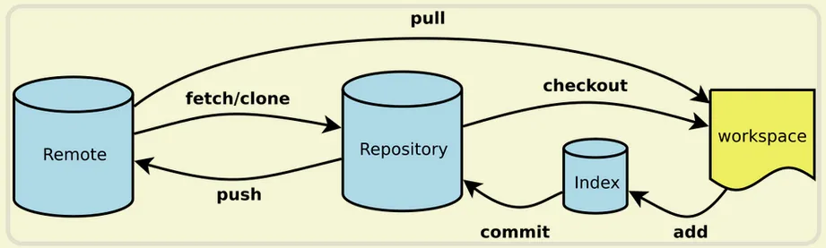

● Remote 表示远端

● Repository 表示存储库

● Workspace 表示工作区

2.2 项目初始化

● mkdir study（创建文件夹）

● cd study（进入文件夹）

● git init（初始化）

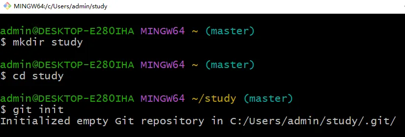

如上图，C:/Users/admin/study/.git/是文件夹的路径，根据路径进入文件夹发现里面什么也没有

2.3 Git 目录

● 为 Window 系统配置 tree 命令环境详见下面这篇文章，其他系统不需要
http://t.csdn.cn/Wfqs4

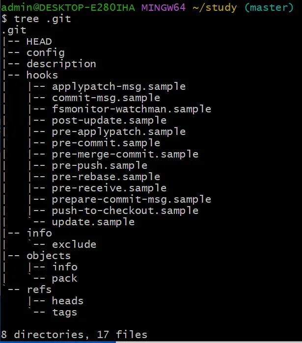

● Tree .git 命令（.git 前面有一空格）

● Tree 命令

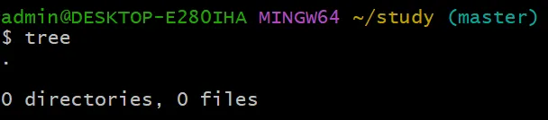

2.4 Git Config（Git 配置）

——每个级别的配置可能重复，但低级别的配置会被高级别的配置覆盖

——用户名配置

● 使用以下命令分别配置用户名和邮箱

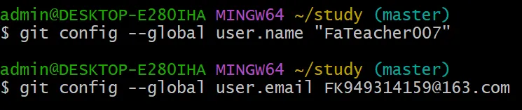

——InsteadOf 配置

● 使用以下命令可以把"git://"替换成"https://"方便使用 https 协议

——查询命令

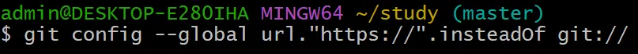

● 可以通过"git config"命令查看更改 Git 配置的所有方法

● 可以通过"git config --list"命令查看 Git 当前的所有配置

● 可以通过"git config --global --list"命令查看当前用户的 global 配置

● 可以通过"git config --system --list"命令查看 Git 的系统配置

● 可以通过"git config --local --list"命令查看当前仓库的配置，需要到仓库目录执行

如果不到仓库目录执行，就会报错：

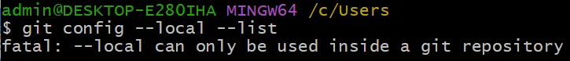

● 可以通过"git config user.name"获取用户名，获取邮箱同理

2.5 Git Remote（远端）

还有一类配置是 Remote 配置，表示本地和远端仓库的关联关系。分为 SSH 和 HTTP 两种

● 使用"git remote -h"命令查询 git remote 所有用法

● 使用"git remote -v"命令查询当前 remote 配置，会发现什么也没有

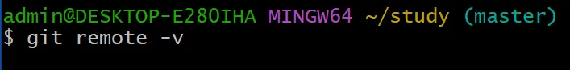

● 现在通过以下两个命令分别添加 SSH 和 HTTP 配置

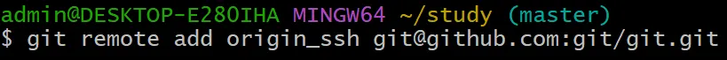

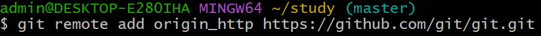

● 现在再次使用"git remote -v"命令

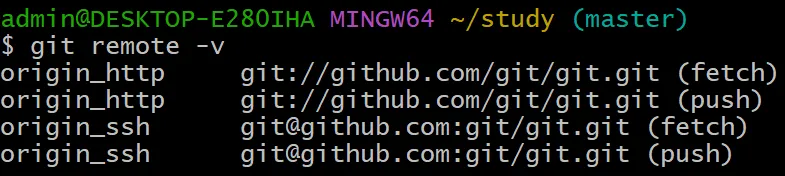

● 或者通过以下命令查询

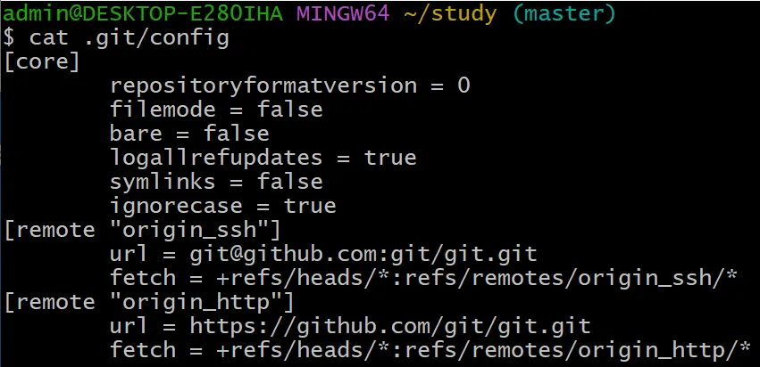

——免密配置

本地与 Remote 进行通信，一般会通过 SSH 和 HTTP 两种协议，且这两种协议均需要对身份进行认证，因此需要配置一下免密的认证方式

● HTTP Remote

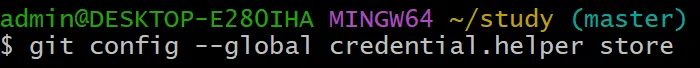

● SSH Remote

SSH 可以通过公私钥的机制，将生成的公钥存放在服务端，从而实现免密访问，目前的 Key 的类型有四种，分别是 dsa、rsa、ecdsa、ed25519，默认使用的是 rsa，由于一些安全问题，现在已经不推荐使用 dsa 和 rsa，优先推荐使用 ed25519

可以通过"ssh-keygen -t ed25519 -C "邮箱""的命令来配置 SSH Remote

——可以在 Github 上进行 SSH 的设置，点击 github 的个人头像进入 Settings，再进入 SSH and GPG keys 即可修改

2.6 Git Add

Git Add 是将 workspace 中的代码提交到 index 空间

● 首先使用"touch 文件名.文件后缀"命令创建一份文件，代码如下

● 使用"git status"命令发现已创建但尚未上传到 index 空间的文件

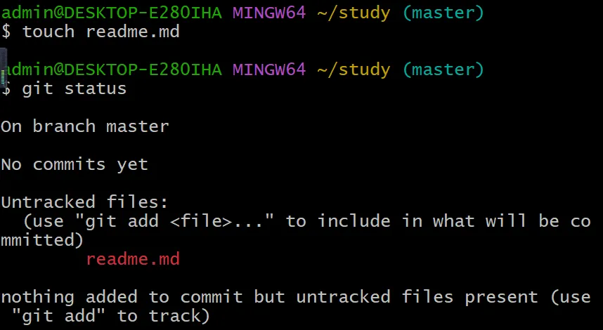

● 使用"git add ."命令将文件上传到 index 空间

● 再次使用"git status"命令发现从红变绿了，说明文件已提交到 index 空间

● 使用"tree"命令查看此时已经有一份文件

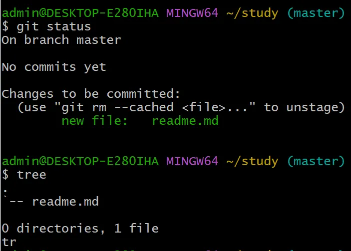

2.7 Git Commit

Git Commit 是将 index 空间的文件提交到 repositary 存储库

● 使用"git-commit -m "标注（标注一般是文件名.文件后缀）""命令提交到存储库

● 提交后再次使用"git status"命令发现已没有文件可以 commit

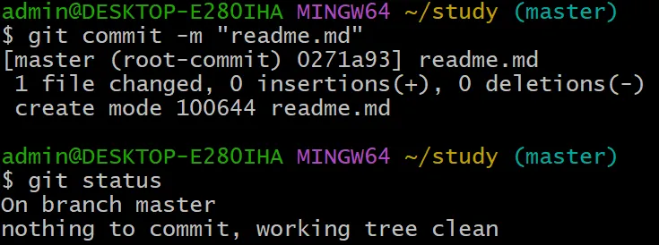

2.8 Objects

commit/tree/blob 在 git 里面都统一称为 object，除此之外还有个 tag 的 object

● blob：存储文件的内容

● tree：存储文件的目录信息

● commit：存储提交信息，一个 commit 可以对应唯一版本的代码

——现在我们要获取刚刚 Commit 到 repositary 区的"readme.md"文件的内容，我们需要这样做：

方法一：直接通过"cat 文件名.文件后缀"命令获取

方法二：一共需要四步

● 使用"tree .git"命令获取 Git 目录（注意，没有 commit 到 repositary 区的文件不会出现在目录中）

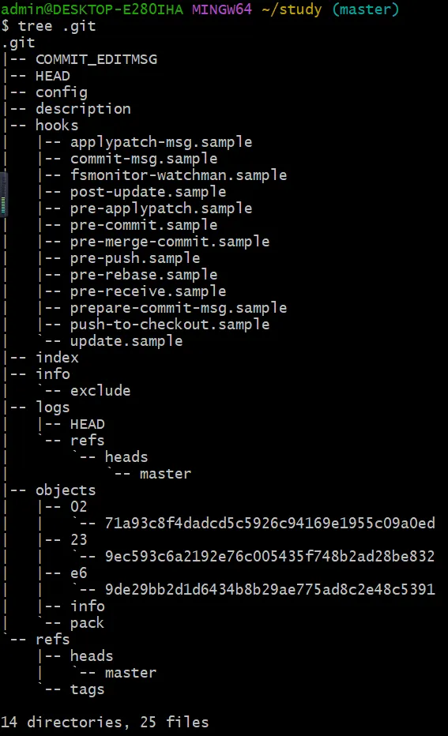

● 每个 commit 都会存储对应的 Tree ID，使用"git cat-file -p CommitID"获取 TreeID

● 再使用"git cat-file -p TreeID"获取 blobID

● 再使用"git cat-file -p blobID"获取到文件内容

额......，会发现啥也没有
因为刚刚创建文件后并没有写入内容，所以现在来写
写文件的方法有三种，第一种是直接通过路径找到文件打开写；
第二种是通过"vim 文件名.文件后缀"的命令来修改；

输入命令"vim readme.md"，打开后是这样的，我们先按"i"键（代表 insert），然后随便写点内容进去。写完之后按一下 Esc 退出键，再输入":wq"，即可退出
第三种是通过"echo "内容" >（>为覆盖，>>为追加）文件名.文件后缀"方式修改（不推荐使用，容易把追加误写为覆盖，什么时候少打了一个 ">" 就真的可以 gg 了）

以上操作完成之后，还需要把刚刚修改过内容的文件再 commit 到 repositary 区，否则再次执行上面的四步后，会发现没有任何变化
文件 commit 之后，blobID 也会改变，因此需要重新查找，不可以直接使用先前的 blobID，也就是四个步骤要重新来一遍

2.9 Refs

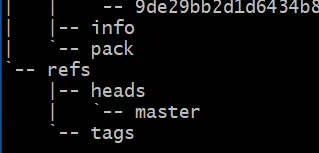

目录部分的 refs 的内容就是对应的 commit ID，因此把 ref 当作指针，指向对应的 commit 来表示当前 ref 对应的版本。refs/heads 前缀表示的是分支，除此之外还有其他种类的分支，比如 refs/tags 前缀表示的是标签

——输入"cat .git/refs/heads/master"获取最新的 commit ID

——Branch（分支）

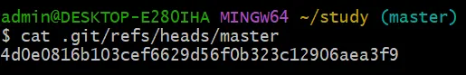

使用"git checkout -b test"可以创建 test 分支。分支一般用于开发阶段，是可以不断添加 Commit 进行迭代的。

——Tag（标签）

标签一般表示的是有一个稳定版本，指向的 commit 一般不会变更，通过"git tag bbb"命令生成 bbb 标签

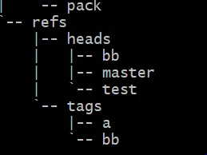

这里创建了一些分支和标签

——使用"git branch"命令获取当前已创建的所有分支，带\*号标绿的为当前所处分支

——使用"git checkout 分支名"命令切换分支

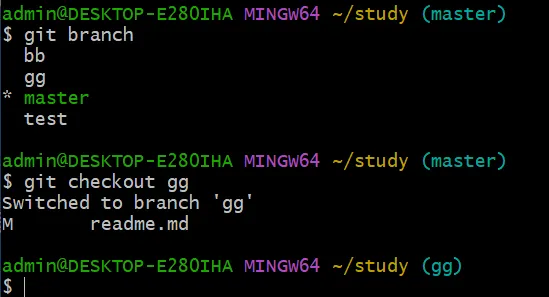

2.10 Annotation Tag（附注标签）

——附注标签是一类特殊的标签，可以给标签提供一些额外信息

● 可以通过"git tag -a 标签名 -m "附注内容""命令来创建附注标签

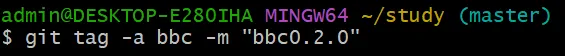

标签是 bbc，标签内容是 bbc0.2.0

● 获取标签的内容，里面包含标签内容的 ID，获取 ID 对应的内容，里面包含当前版本的 commit ID 和标签的附注内容

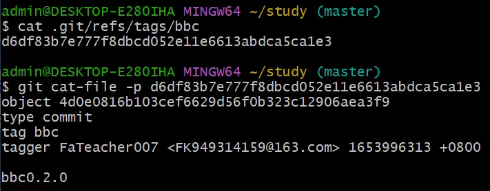

● 如果不是附注标签，只是普通的标签，则只会显示当前版本的 commit ID

2.11 追溯版本历史

● 为了有前后对照，先用命令修改文件内容

● git add 和 git commit

● 再获取当前版本代码（当前版本的 commit ID)

● commit 里面会有 parent commit 字段，通过 commit 的串联获取历史版本代码，一直获取 parent commit 可以追溯更久远的代码版本

完整代码如下，这里获取了两次历史代码

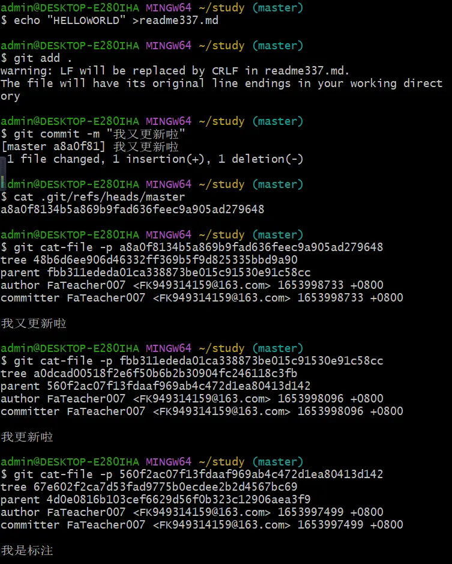

2.12 修改版本历史

——修改 commit message

● 可以通过"git commit --amend"命令来修改最近一次 commit 的 commit message

这里将"我又更新啦"替换为"哈哈哈我又更新啦"

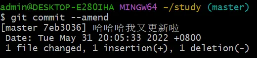

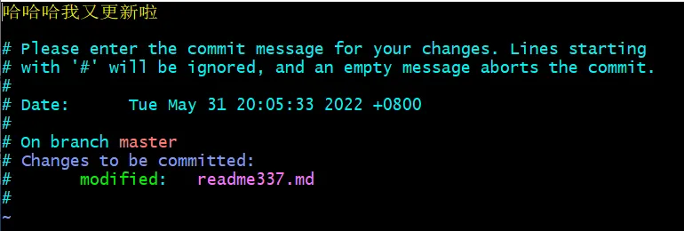

修改完毕后，再用老方法获取 commit message，发现不仅 commit message 已更改，commit ID 也更改了

——对多个 commit 修改 commit message

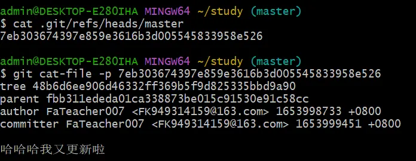

可以使用"git rebase -i HEAD~3"命令对最近的三个 commit 进行修改,这里给每个 commit message 加五个感叹号！

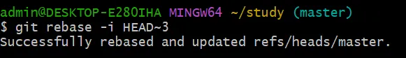

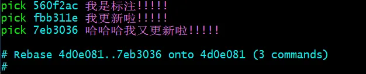

2.13 Git GC

在进行 git 指令操作的过程中，会产生很多没有用的垃圾 object，叫做悬空的 object（即没有 ref 指向的 object）

● 通过"git fsck --lost-found"命令可以发现所有悬空的 object

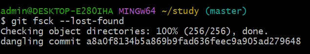

● 通过"git gc"命令可以将悬空的 object 全部回收

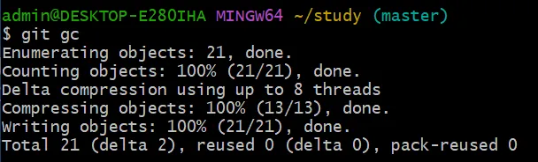

回收之后的"tree.git"就变成了这样：（发现 objects 里的东西都被打包了）

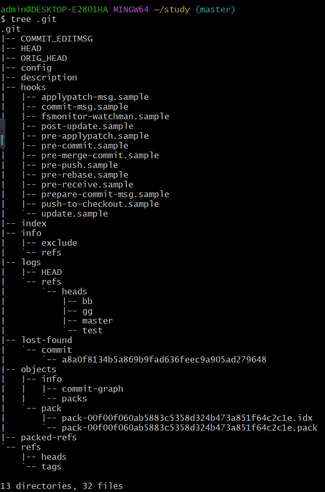

2.14 Git reset（误删回滚，针对 git gc 误删了某些 commit）

可以通过 git reset 回滚 commit 版本，每次 reset 的记录都会被记录到 reflog 中
reflog 是用于记录操作日志，防止误操作后数据丢失的，通过 reflog 可以找到丢失的数据，手动将日志设置为过期

● 首先使用"git log --oneline"获取 Git 的历史记录，可以查看每一次的 commit 记录

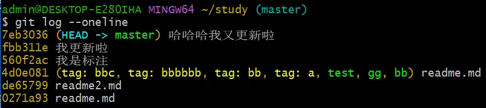

● 再使用"git reset --hard xxxxxxx"命令来将代码回滚到"xxxxxxx"版本

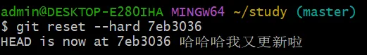

● 可以使用"git reflog"查看之前做过的 reset 命令

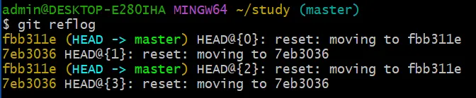

2.15 Git Clone & Pull & Fetch

● Clone：拉取完整的仓库到本地目录，可以指定分支和深度

● Fetch：将远端某些分支的最新代码拉取到本地，不会执行 merge 操作，会修改 refs/remote 内的分支信息，如果需要和本地代码合并需要手动操作

● Pull：拉取远端某分支，并和本地代码进行合并，操作等同于"git fetch + git merge"，也可以通过"git pull --rebase"完成"git fetch + git rebase"操作

● 前两个是从远端拉取到存储库，而 Pull 是从远端直接拉取到工作区

最常用的是 clone，然而在 git clone 时会发现一堆问题，这里将几个常见的问题汇总
随便在 github 上找一个代码库拿去 git clone

1. fatal: unable to look up github.com (port 9418) ()

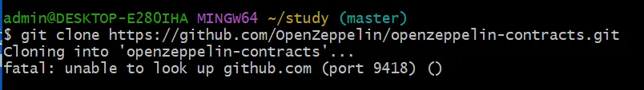

解决方案：将 https 改为 git 即可（或者把本文 2.4 的 insteadOf 改一下）

2. Could not resolve host: gihub.com（无法 ping 通 github.com)

解决方案：修改 hosts 文件中的域名配置

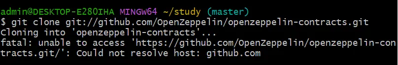

操作步骤：

● 用管理员模式打开记事本

● 打开 hosts 文件（路径为 C:\Windows\System32\drivers\etc）

● 在图示位置添加"140.82.114.4 github.com"，切记，不能加"#"

● 保存即可，打开 gcmd 后发现可以 ping 通 github.com 了

3. OpenSSL SSL_read: Connection was aborted, errno 10053（在 github 上没有配置 SSH 公钥）

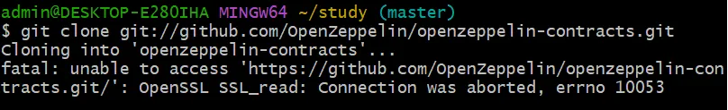

解决方案：获取 SSH 公钥并在 github 上进行配置

操作步骤：

● 在 Git 中输入图示命令获取 SSH 公钥（前提是完成本文 2.5 的 SSH 配置）

● 打开 github，点击头像，进入 Setting，点击"SSH and GPG keys"，再点击"New SSH key"，将 SSH 公钥复制进去，保存即可

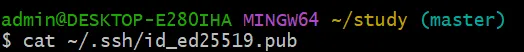

以上三种错误最为常见，一般依次处理完后，"git clone"就没啥问题了

2.16 Git Push

Git Push 是将本地代码同步到远端

——把写的代码上传到 github 上该如何操作？

1. 首先登录 Github，找到这个界面

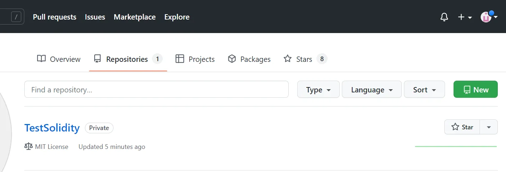

2. 点击右上角那个绿色，New 一个 Repositary

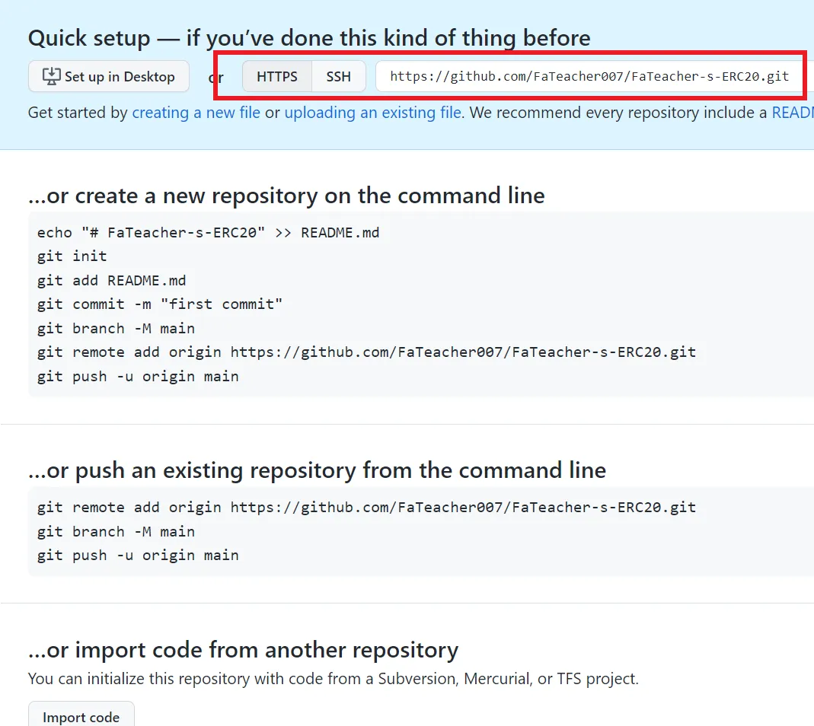

3. New 完之后会出现下面这个界面（教操作的）

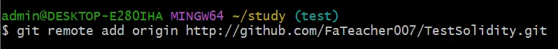

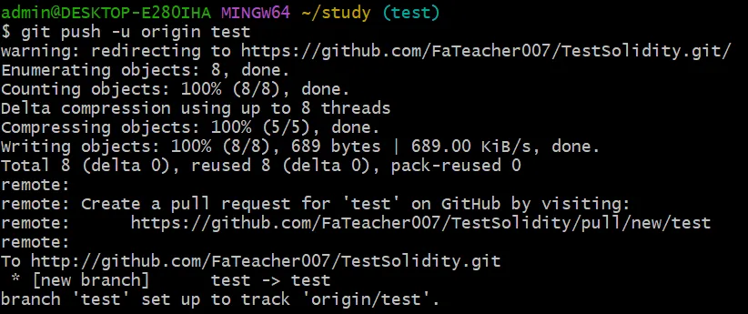

大概就是教我们怎么在 Git 上进行代码的 push 操作，具体的看文档跟着操作就可以了。画红框的部分是，是刚刚在 github 上创建的 repositary 的 URL

这里随便操作演示一下：

上 github 查询一下，就会发现代码已经 Push 上来了~~~

以上关于 Git 的基本操作就介绍完了，剩下的其实也不太常用，遇到了查文档就行~~~
