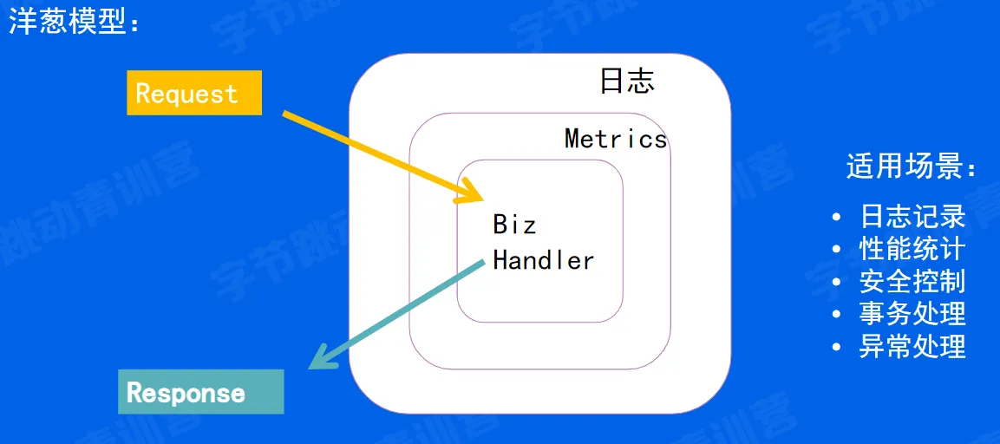

一：相关基础概念解释

1.1：什么是 HTTP？

HTTP 是超文本传输协议，拆开来看，就是超文本+传输+协议。归根到底 Http 就是一个应用层的协议，只不过是用来传输的，传输的内容是超文本。

——什么是超文本？

一开始，互联网并不叫互联网，因为它不能将两台服务器串联起来，数据无法在两台服务器之间传输，输入的信息只能保存在本地。保存的信息通常以“文本”这种简单的形式存在（文本是一种能够被计算机解析的二进制数据包文件）。后来随着互联网的发展，两台服务器之间能够进行数据传输后，人们也不再满足于只能写入文字和传输文字。于是超文本诞生了，超文本包括图片、视频、跳转链接等。

所以，HTTP 经典的解释是：HTTP 是一份在计算机网络中专门在两台服务器之间传输文字、图片、视频、音频等超文本数据的规范协议。

1.2：引入——计算机网络模型

1.3：HTTP 相关协议

● IP 协议、TCP 协议、DNS 服务

关于上述三个协议的具体解释以及与 HTTP 协议的关系详见：
http://t.csdn.cn/RH7ws

以下是上述文章内容的部分摘取

● IP 协议
IP 网际协议位于网络层，几乎所有使用网络的系统都会用到 IP 协议。TCP/IP 协议族中的 IP 指的就是网际协议，"IP"和"IP 地址"是不同的，"IP"其实是一种协议的名称。
IP 协议的作用是把各种数据包传送给对方，而要保证确实传送到对方那里，则需要两个重要的条件， IP 地址和 MAC 地址。IP 地址指明了节点被分配到的地址，MAC 地址是指网卡所属的固定地址。IP 地址可以和 MAC 地址进行配对。IP 地址可变换，但 MAC 地址基本上不会更改。
ip 间的通信依赖于 mac 地址，在信息传输中，有时候由于中转太多，因此会采用 ARP 协议(解析地址的协议)，通过 ip 地址就可以反查出对应的 mac 地址。

● TCP 协议
TCP 位于传输层，提供可靠的字节流服务。TCP 协议为了更容易传送大数据，把大块数据分割成以报文段为单位的数据包进行管理，并且能够确认数据最终是否送达到对方。
为了保证传输的可靠性，TCP 协议采用了三次握手的策略。TCP 协议把数据包发送出去后，会向对方确认是否成功送达，握手过程中使用了 TCP 的标志——SYN 和 ACK。发送端首先发送一个带 SYN 标志的数据包给对方。接收端收到后，回传一个带有 SYN/ACK 标志的数据包以示传达确认信息。最后，发送端再回传一个带 ACK 标志的数据包，代表“握手”结束，这就是三次握手。若在握手过程中某个阶段莫名中断，TCP 协议会再次以相同的顺序发送相同的数据包。

● DNS 服务
DNS 服务是和 HTTP 协议一样位于应用层的协议。它提供域名到 IP 地址之间的解析服务。
计算机可以被赋予 IP 地址，也可以被赋予主机名或域名。由于主机名或域名比 IP 更容易记忆，用户通常使用主机名或者域名来访问对方的计算机，而不是直接使用 IP 地址访问。DNS 协议提供通过域名查找 IP 地址，或逆向从 IP 地址反查域名的服务，从而实现通过域名或主机名访问的效果。

二：HTTP 请求

2.1：HTTP 协议的请求报文

先上两张图，在www.baidu.com中搜索“233”的请求和响应报文如下

Http 协议主要由三大部分组成：

● 请求行/状态行（Header）——描述 request/response 的基本信息

● 请求头/响应头（Header）——使用 key-value 的形式更详细地说明报文

● 请求体/响应体（Body）——实际传输的数据，即消息正文，不一定是文本，可以是超文本

一份 Http 报文中，可以没有 Body，但一定要有 Body
上面两张图中，第一行均为请求行/状态行。在 Request（请求）中，格式为（方法名+URL+协议版本）；在 Response 中，格式为（协议版本+状态码+状态码描述）。第二行开始均为请求头/响应头，使用 k-v 对的形式对请求/响应进行描述。

2.2：HTTP 常用请求方法汇总

1. GET：获取资源
2. POST：传输实体主体
3. HEAD：获取报文首部
4. PUT：传输文件
5. DELETE：删除文件
6. CONNECT：要求用隧道协议连接代理
7. OPTIONS：询问支持的方法
8. TRACE：追踪路径

2.3：HTTP 请求 URL

Http 协议使用 URL 定位互联网上的资源，URL 的格式如上图，一共分为六个部分

1. 协议：告诉浏览器使用何种协议。对于大多数的 Web 资源，都是使用 Http/Https 协议
2. 主机：即域名，指示需要向网络中的哪一台主机发起请求。当然也可以使用 IP 地址发起请求（比如向本地 127.0.0.1）
3. 端口：两台主机发起 TCP 连接需要“主机+端口”两个条件，缺一不可。但如果访问的 Web 服务器使用的是 Http 协议的标准端口（80 或 443），则 URL 的端口部分可省略不写
4. 路径：跟文件路径的写法类似，表示的是请求主机中的文件路径
5. 查询：提供给 Web 服务器的额外参数，每个 k—v 对中间由&分隔
6. 片段：定位标识符。如果是 HTML 文档，浏览器会滚动到片段所描述的位置；如果是音频文件，会定位到片段描述的时间

2.4：补充——状态码汇总

状态码是一个三位数

● 1 开头：信息类

● 2 开头：表成功

200：成功响应

204：请求处理成功，但是没有资源可以返回

206：对资源的某一部分进行响应，由 Content-Range 指定范围的实体内容

● 3 开头：重定向

301：永久重定向，表示请求的资源已重新分配 URI，以后应当使用资源现有的 URI 对其进行访问

302：临时重定向，表示请求的资源临时分配了新的 URI，用户本次需要使用新的 URI 进行访问

303：请求的资源存在着另一个 URI，应使用 GET 方法定向获取资源

304：表示客户端发送附带条件的请求时，服务器端允许请求访问资源，但是未满足既定条件

307：与 302 含义相同

● 4 开头：客户端错误

400：请求的报文存在语法错误

401：发送的请求需要有通过 HTTP 认证的认证信息

403：表明请求被服务器拒绝了

404：表明服务器上无法找到该请求对应的资源

● 5 开头：服务端错误

500：表明服务器在执行请求时发生了错误

503：表明服务器暂时处于超负载或正在进行停机维护，暂时无法处理请求

2.5：HTTP 整个请求响应过程

用户在浏览器输入网址--->DNS 服务器对域名进行映射，找到被访问网址所对应的 IP 地址--->Http 进程在 80 端口发起一个到目标服务器的 TCP 连接--->Http 客户端通过套接字向服务器发送一个 Http 请求（Request）报文--->Http 服务器通过套接字接收 Request 报文，并对其进行解析--->服务器从存储器/磁盘检索对象--->服务器将检索到的对象封装进 Response 报文中，并通过套接字向客户端进行发送--->Http 服务器通知 TCP 断开 TCP 连接（客户端接收到 Response 报文后才会断开）--->Http 客户端把对应资源通过显示器呈现给用户

2.6：HTTPS

Https=Http+SSL，就是 Http 协议之上加了一个 SSL（安全套接字）协议
Http 一般是明文传输，易被攻击者窃取到重要信息。而 Https 是在 Http 基础之上通过“传输加密和身份认证”保证了传输的安全性。

三：HTTP 框架的分层设计

3.1：分层设计图

自上而下分别是：
应用层、中间件层、路由层、协议层（编解码层）、网络层

3.2：应用层设计

——设计规范

应用层需要保证“易用性”，因此需要提供一些合理的 API

1. 可理解性：使用主流的概念，如 ctx.Body()、ctx.GetBody()、避免使用 ctx.BodyA()类似的语句
2. 简单性：常用的 API 要放在上层，易误用/低频的 API 放下层。比如 ctx.Request.Header.Peek(key)/ctx.GetHeader(key)
3. 可见性：遵循最小暴露原则，不需要暴露的 API 尽量不暴露，可以抽象为接口
4. 兼容性：尽量避免 break、change，做好版本管理
5. 冗余性：要避免冗余（不要出现能通过其他 API 得到的 API）

3.3：中间件层设计

——洋葱模型（中间件典型模型）

简述：客户端发送请求后，首先要先经过日志中间件的预处理，再经过 Metrics 中间件的预处理。处理完之后再进行真正的业务逻辑。在这之后，还会有一个后处理的过程。执行完业务逻辑后会先进行 Metrics 中间件的后处理，再进行日志中间件的后处理
（即日志中间件——>Metrics 中间件——>业务逻辑——>Metrics 中间件——>日志中间件）

——为什么要中间件？

假设现在需要打印每个请求的 request 和 response
假如没有中间件：
会发现非常繁琐，每写一个业务逻辑都要重新写一遍打印日志的代码

假如有中间件：

可以只写一遍打印日志的代码
这里只有一个中间件，但在现实中，其实是存在多个中间件联合运作的。而多个中间件之间由 ctx.Next()进行连接。
——那么问题来了，下图中出现的 ctx.Next()，它是如何在多个中间件和真正的业务逻辑代码之间运作的？
ctx.Next()，只能在中间件之间使用，它会挂起当前中间件（也就是 ctx.Next(）后面的代码先不执行），而先执行后面的中间件，当没有下一个中间件时，就开始执行真正的业务逻辑代码。执行完毕后，再执行每一个中间件 ctx.Next(）后面的代码（由洋葱模型知，先挂起的后执行）

3.4：路由层设计

● 静态路由：/a/b/c 、/a/b/d .......

● 参数路由：/a/:id/c（/a/b/c 或/a/d/c 或......）

● 路由修复：/a/b <——>/a/b/（即如果是只注册了/a/b，但是访问的 URI 是 /a/b/，那可以提供自动重定向到 /a/b 能力；同样，如果只注册了 /a/b/，但是访问的 URI 是 /a/b，那可以提供自动重定向到 /a/b/ 能力）

● 冲突路由：同时注册 /a/b 和 /:id/b，并设定优先级。比如：当请求 URI 为 /a/b 时，优先匹配静态路由 /a/b

参数路由的设计方法：

——map[string]handlers（一个参数对应一个 handers）
——前缀匹配树（如下图）

3.5：协议层（编解码层）设计

任何协议，只要实现了上图中的 Server 接口，就可以被注册到框架中来
包括 http1、http2、QUIC 等协议都是实现了上述的 Server 接口

3.6：网络层设计
有关网络层 IO 的介绍，请详见这篇文章：
http://t.csdn.cn/gDup7
