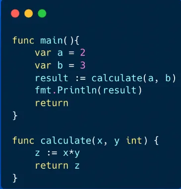
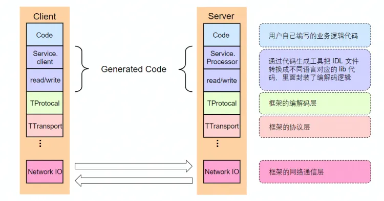
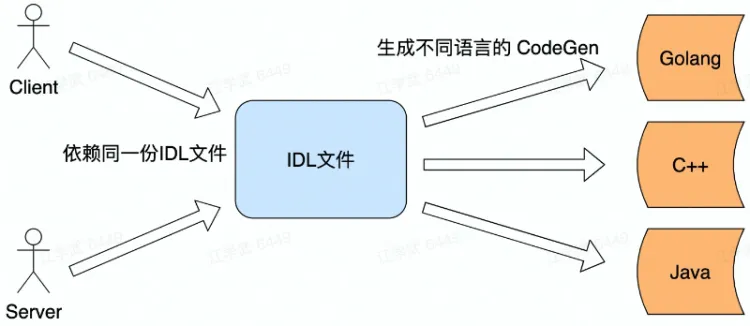
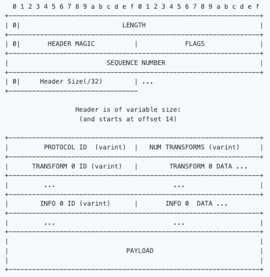
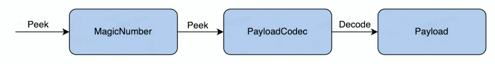
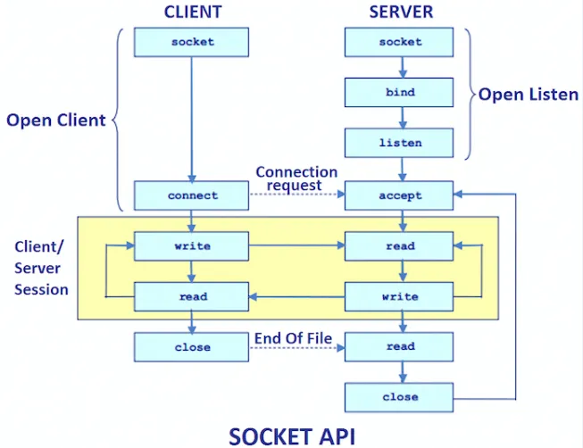
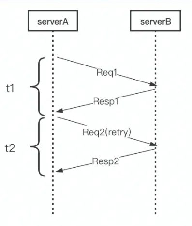
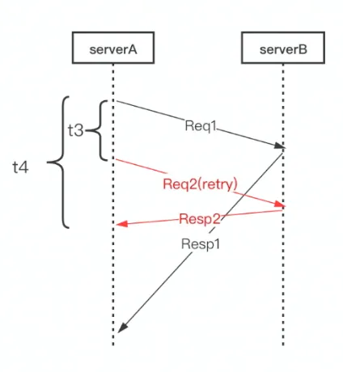

一：RPC 框架简介

1.1—为什么？

在了解什么是 RPC 框架之前，先来看下面这段代码

这一段代码表示的是本地调用函数的过程。在业务实现中，常常把整个业务中多次出现的业务逻辑从主函数（不一定是主函数，也可以是其他函数）中抽离出来，单独写一个函数或包来给其他函数进行调用。以此来让整个业务逻辑更加清晰，在后续的代码优化中，也更加方便，也让代码有更强大的扩展性。

而 RPC（Remote Procedure Call），即远程服务调用，目的亦是如此。但为什么要使用 RPC 而不采取本地调用呢？原因很简单，如果一个项目的访问量不大，一台服务器上部署一个应用+数据库就足够了。但如果一个项目市场很大，意味着访问量很大，那么一台服务器就很难满足需求，因为用户量增多，必然带来卡顿。由此就产生了 RPC 服务框架（emmm，其实中间省略了很多过程，真实的演进过程其实没那么快）

1.2—是什么？

RPC 是指远程过程调用协议，简单起见，这里只涉及两台服务器。两台服务器 A、B，一个应用部署在 A 服务器上，想要调用 B 服务器上的函数，但由于不在一个内存空间，是不能直接调用的，需要通过网络来表达调用的语义和传输调用的参数。
RPC 还具有以下几大优点：
● 单一职责，有利于分工协作和运维开发
● 可扩展性强，资源使用率更优
● 故障隔离，服务的整体可靠性更高

1.3—常用的 RPC 框架

1.3.1—单语言支持

Dubbo：国内最早开源的 RPC 框架，由阿里巴巴公司开发并于 2011 年末对外开源，仅支持 Java  
Spring Cloud：国外 Pivotal 公司 2014 年对外开源的 RPC 框架，仅支持 Java
Tars：腾讯内部使用的 RPC 框架，于 2017 年对外开源，仅支持 C++

1.3.2—多语言支持

gRPC：Google 于 2015 年对外开源的跨语言 RPC 框架，支持多种语言  
Thrift：最初是由 Facebook 开发的内部系统跨语言的 RPC 框架，2007 年贡献给了 Apache 基金，成为 Apache 开源项目之一，支持多种语言

二：RPC 框架的分层设计

2.1—重要名词解释释

①IDL 文件：
接口定义语言，是跨平台开发的必备文件。IDL 通过一种中立的方式来描述接口，使得在不同平台上运行的对象和用不同语言编写的程序之间可以互相通信。
● 常见的 Thrift 和 Protobuf 都是接口定义语言

②Client——Server：
Client 是服务的调用端（需求端），Server 是服务的提供端。举两个之前看到的例子：
操作系统——硬件系统，就是一组 Client—Server。操作系统作为 Client 来调用硬件系统（Server）所提供的服务
应用软件——操作系统，也是一组 Client—Server。
同样放到这里，两台服务器，A 服务器作为 Client 来调用 B 服务器（Server）

③TCP
TCP 即传输控制协议（Transmission Control Protocol），是一种面向连接的、可靠的、基于字节流的传输层通讯协议。  

④Socket
Socket 是应用层和传输层之间的一个抽象层，它把 TCP/IP 层复杂的操作抽象为了几个简单的接口来供应用层调用已实现进程在网络中通信。socket 是一种"打开—读/写—关闭"模式的实现，服务器和客户端各自维护一个"文件"，在建立连接打开后，可以向自己文件写入内容供对方读取或者读取对方内容，通讯结束时关闭文件。

2.2—分层设计结构

2.2.1—分层设计图解

下图是 Apache Thrift 的分层设计结构图

由上图，可以概述 RPC 服务的大致流程：
Client 以本地调用的方式发起服务调用--->Client 持续把请求参数和方法序列化成二进制数据（打包成能进行网络传输的消息体）--->Client 将消息体通过网络发送给 Server--->Server 从 TCP 通道里面接收到消息体--->根据 RPC 协议，Server 方将二进制数据的消息体分割出不同的请求数据，经过反序列化逆向还原出请求对象--->Server 方找到本地对应的参数和方法--->Server 方将执行结果序列化成二进制数据（打包成能进行网络传输的消息体）--->Server 方将消息体回写到 TCP 通道--->Client 方从 TCP 通道获取消息体--->Client 方将消息体进行反序列化得到最终的调用结果

2.2.2—编解码层

—生成代码：

—数据格式：
● 语言特定的格式：许多编程语言都内建了将内存对象编码为字节序列的支持，如 Java 的 Java.io.Serializable

● 文本格式：具有人类可读性，如 Json、XML、CSV 等

● 二进制编码：具有跨语言和高性能的优点，如 Thrift 的 BinaryProtocol 和 Protobuf 等

—编解码协议如何选择？
两大方面考虑：通用性和兼容性

通用性：分为技术层面和流行程度。技术层面上，要考虑是否支持跨平台，跨语言，如果不支持，通用性大大降低。流行程度上，编解码过程需要多方参与，要尽可能减少学习成本，另外流行度低的协议往往支持的平台和语言也少。

兼容性：移动互联网时代，业务需求更新周期很快，但老的系统依然需要维护。如果序列化协议具有良好的可扩展性，支持自动增加新的业务字段，而不影响老的服务，将大大提高系统的灵活度

2.2.3—协议层

—消息切分：
● 特殊结束符：
过于简单，对于一个协议单元必须要全部读入才能进行处理，除此之外必须防止用户传输的数据不能同结束符相同，否则会出现紊乱，因此使用频率低。

● 变长协议：
一般都是自定义协议，由 header 和 payload 组成，由定长加不定长两部分组成，其中定长部分要描述不定长的内容长度，使用比较广泛。

—协议构造

从上到下：

1. Length（32bits）：数据包大小，不包含自身

2. Header Magic（16bits）：标识版本信息，协议解析时快速校验，如 0x1000

3. Flags（16bits）：预留字段，可以不被使用，默认值为 0x0000

4. Sequence Number（32bits）：表示数据包的 seqID，可用于多路复用，最好确保单个连接中 ID 递增

5. Header Size（16bits）：等于头部长度字节数/4，（头部长度从第 14 个字节开始计算，一直到 Payload 部分前）

6. Protocol ID（uint8 编码）：表示编解码的方式，有 Binary 和 Compact 两种

7. Num Transforms（uint8 编码）：表示需要 Transform 的个数

8. Transform ID （uint8 编码）：表示压缩的方式，如 zilb 和 snappy

9. Info ID（uint8 编码）：用于传递一些定制的 Meta （元）信息

10. Payload：消息内容

—协议解析

2.2.4—网络通信层
—socket API 建立网络通讯

—接口详解

● socket()：创建 socket

● bind()：绑定 socket 到本地地址和端口，通常由 Server 端调用

● listen()：TCP 专用，开启监听模式

● accept()：TCP 专用，服务器等待客户端连接，一般是阻塞状态

● connect()：TCP 专用，客户端主动连接服务器

● send()：TCP 专用，用于发送数据

● recv()：TCP 专用，用于接收数据

● sendto()：UDP 专用，发送数据到指定的 IP 地址和端口

● recvfrom()：UDP 专用，接收数据，返回数据远端的 IP 地址和端口

● close()：关闭 socket

● read()：读取数据，socket 默认是阻塞模式的，如果对方没有写数据，read 会一直处于阻塞状态

● write()：写数据，socket 默认是阻塞模式的，如果对方没有写数据，write 会一直处于阻塞状态

—网络库
通常来说，主流操作系统都有网络支持，并且提供网络 API，但这些网络 API 非常底层，并不是很好用。而引入网络库可以：
● 提供易用的 API：封装底层 Socket API，实现连接管理和事件分发
● 更强大的功能：支持 TCP、UDP、UDS 多协议；并能优雅退出、进行异常处理等
● 更强大的性能：使应用层 buffer 减少 copy，提供高性能定时器、对象池等

三：RPC 框架的重要指标

3.1—稳定性

3.1.1—保障策略

● 熔断：一个服务 A 调用服务 B 时，服务 B 的业务逻辑又调用服务 C，若此时服务 C 响应超时，由于服务 B 依赖服务 C，C 超时直接导致 B 的业务一直等待，而这个时候服务 A 继续频繁地调用服务 B，B 就可能因为堆积大量的请求而导致服务宕机。因此需要引入熔断机制，保护调用方，防止被调用的服务出现问题而影响整条链路。
● 限流：当调用端发送请求过来时，服务端在执行业务逻辑之前应当先检查限流逻辑。如果发现访问量过大，就让服务端直接讲解处理或返回给调用端一个限流异常。
● 超时：当下游的服务因为某种原因响应过慢，下游服务主动停掉一些不太重要的业务，释放出服务器资源，避免造成资源浪费

3.1.2—请求成功率

好的 RPC 服务框架，应该能限制单点重试和限制链路重试
因为重试有放大故障的风险，重试会加大下游业务的负载。重试越多，下游服务负载越高，就越容易导致调用不成功，这是一个正反馈过程。

3.1.3—长尾请求

右图设计了一个优化的请求过程，是基于长尾请求设计的。
长尾请求是指明显高于均值的那部分占比比较小的请求。右图预先设定了一个 t3，保证大部分请求在这个时间间隔内可以返回请求。而不能在 t3 内返回请求的（一般是产生了问题），就会再发送一个请求（即重试）。这样，两次请求只要有一个返回，就会结束掉这段业务代码。这种机制可以大大减少整体延时。

3.2—易用性

● 生成服务代码脚手架
● 支持 protobuf 和 thrift
● 内置功能丰富的选项
● 支持自定义的生成代码插件

3.3—扩展性

通过中间件、Option（可选参数）、编解码层的数据格式的可扩展性、协议层的变长协议、网络传输层优化、代码生成工具插件等方式来实现高扩展性

3.4—观测性

传统上会采用 Log、Metric、Tracing 三件套实现请求的观测性。但可能还不够，有些框架的自身状态需要暴露出来，比如当前的环境变量、配置、Client/Server 初始化参数、缓存信息等

3.5—高性能

高性能=高吞吐+低延迟
手段：连接池、多路复用、高性能编解码协议、高性能网络库

