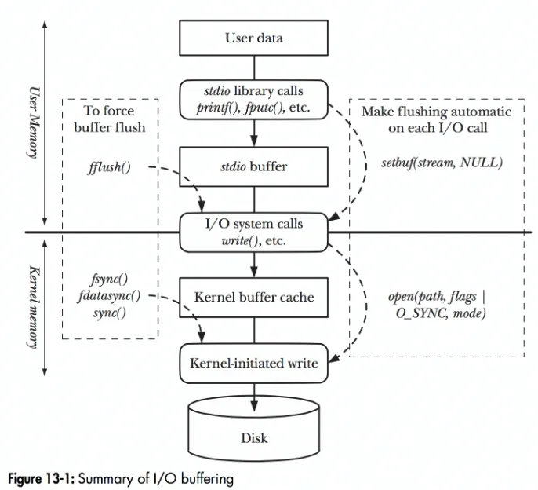
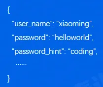
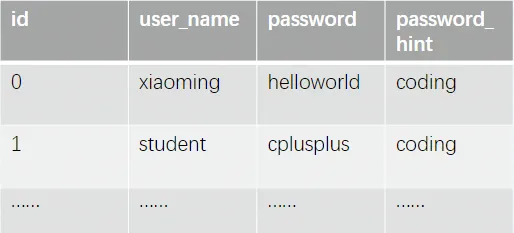
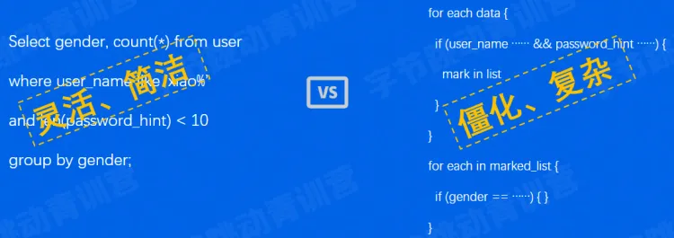
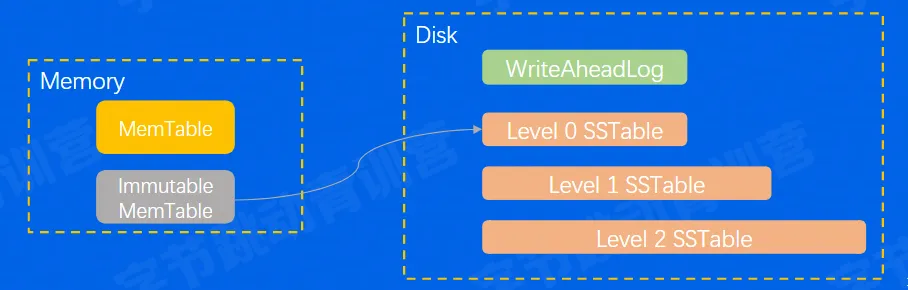
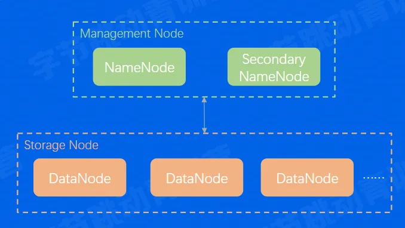
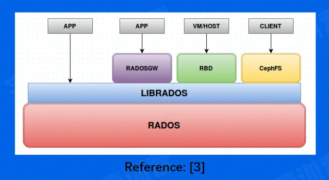
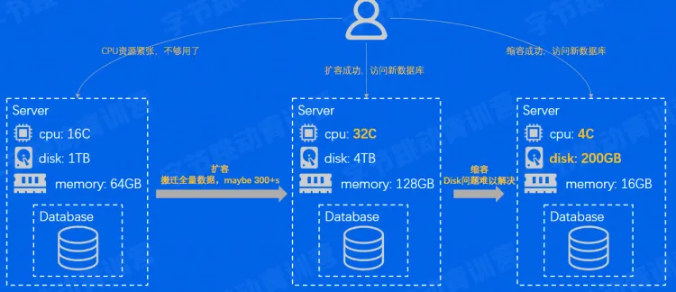
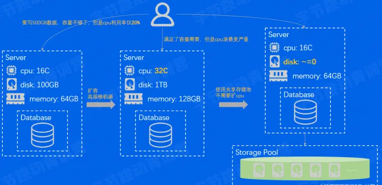

一：存储系统

1.1 存储系统基础

What——存储系统是一个提供了读写、控制类接口，能够安全有效地把数据持久化的软件

How——① 作为后端软件的底座，性能敏感；② 存储系统软件架构，容易受硬件影响；③ 存储系统的代码，既简单又复杂

1.2 数据如何从应用到存储介质？

数据的缓存很重要，几乎贯穿整个存储体系

而在存储中要尽量少使用昂贵的拷贝操作

存储的硬件设备五花八门，需要有抽象统一的接入层

1.3 存储技术：RAID 磁盘阵列（独立冗余磁盘阵列）

——技术背景：

● 性能：单块磁盘写入性能 < 多块磁盘的并发写入性能

● 成本：单块大容量磁盘价格 < 多块小容量磁盘

● 可靠性 ：单块磁盘的容错能力有限，不够安全

单机存储系统如何做到高性能/高性价比/高可靠性？

——RAID：

● 把多块独立的物理硬盘按照不同的方式组合起来形成一个硬盘组（逻辑硬盘）。从而提供比单个硬盘更高的存储性能和提供数据备份技术。

——RAID 0 // RAID 1 // RAID 1+0

● RAID0（条带化存储）——提性能

连续以位或字节为单位分割数据，并行读/写于多个磁盘上，因此具有很高的传输效率。但 RAID0 只是单纯地提高性能，并没有为数据的可靠性提供保证，而且其中一个磁盘失效将影响到所有的数据。因此无法应用到对数据安全性很高的场合

● RAID1（镜像存储）——提可靠性

通过磁盘数据镜像实现数据冗余，在成对的独立磁盘上产生互为备份的数据，因此写入效率较低。当原始的数据繁忙时，可直接从镜像拷贝中读取数据，因此 RAID1 可以提高读取性能。RAID1 是所有磁盘阵列中单位成本最高的。但提供了很高的数据安全性和可用性。当一个磁盘失效时，系统可以自动切换到镜像磁盘上读写，而不需要重组失效的数据

● RAID 1+0（先做镜像，再做条带）——提性能和可靠性

将 RAID0 和 RAID1 结合，既满足了存储的可靠性，也大大提高了性能

——更多对 RAID 技术的介绍，详见这篇文章：http://t.csdn.cn/R9QKA

二：数据库系统

2.1 数据库分类

数据库分为两类：关系型数据库和非关系型数据库

——关系是啥？

关系 = 集合 = 任意元素组成的若干有序偶对

——关系代数是啥？

关系代数 = 对关系作运算的抽象查询语言（交、并、补、笛卡尔积等）

——关系型数据库是啥？

本质就是存储系统，但是在存储之外，又发展出了其他能力。比如：① 对结构化数据很友好，处理高效；② 支持事务；③ 支持复杂的查询语言（如 SQL）

——非关系型数据库是啥？

本质也是存储系统，但是和关系型数据库不同，非关系型数据库一般不要求严格的结构化数据，它也可能会支持事务，甚至可能支持复杂的查询语言。

2.2 数据库 VS 经典存储

1. 结构化数据管理

比如一条用户的注册数据，现在要将其进行存储：

如果用经典存储：

如果用数据库：

一般存储的意义，就是要实现对数据的查询。而数据在实际的应用中，不可能是一成不变的，因此还需要实现增删改。而判断一个存储系统的性能好坏，一个重要标准就是增删改查是否方便。对比经典存储和数据库两种存储方式可发现：经典存储是要求对每个数据进行元信息（比如长度、格式等）和数据本身的存储，这时候对数据的增删改是个极大的麻烦

比如我要删除"xiaoming"这个数据，为了不浪费存储空间，就需要对后面的数据进行移位操作，而且删除"xiaoming"这个信息，后面的"helloworld"和"coding"两个数据也要一并删除，逻辑之多处理也不方便，对程序员是一个极大的痛苦

而使用数据库则方便得多，因为数据存储的结构是十分清晰的

2. 事务能力

经典存储很难或根本无法对事务进行处理，但数据库支持。

事务具有以下四个特性：

● A（原子性）：事务内的操作要么全做，要么不做

● C（一致性）：事务执行前后，数据状态要是一致的

● I（隔离性）：可以隔离多个并发事务，避免互相影响

● D（持久性）：事务一旦提交成功，要保证持久性

3. 复杂查询能力

经典存储如果要做很复杂的查询，实现的代码也是相当复杂的，需要不断地对数据进行遍历。而数据库提供了 SQL 语言，对复杂的查询十分友好。

三：主流产品介绍

3.1 单机存储

单机存储 = 单个计算机节点上的存储软件系统，一般不涉及网络交互

1. 本地文件系统

● 文件系统的管理单元：文件

● 文件系统接口：如 Ext2/3/4，sysfs、rootfs 等

● Linux 文件系统的两大数据结构：Index Node & Directory Entry

Index Node：记录文件的元数据，如 id、大小、权限、磁盘位置等。inode 是一个文件的唯一标识，会被存储到磁盘上。

Directory Entry：记录文件名、inode 指针、层级（parent）关系等。dentry 是内存结构，与 inode 关系是 N:1

2. key - value 存储

——key 相当于是数据/文件的身份证，value 相当于是数据本身

● 常用数据结构：LSM-Tree，是一种牺牲读性能，追求写入性能的数据结构

3.2 分布式存储

1. 分布式文件系统

● HDFS（堪称大数据时代的基石）

HDFS 的核心特点：

● 高吞吐量：支持海量数据存储

● 高容错性：数据自动保存多个副本，某一副本丢失可以自动恢复

● 弱 POSIX 语义：牺牲了一些 POSIX 的需求来补偿性能，有些操作会和传统的文件系统不同

● 性价比高：使用普通 x86 服务器

2. 分布式对象存储

● Ceph（开源分布式存储系统里的万金油）

Ceph 的核心特点：

● 一切皆为对象：一套系统支持对象接口、块接口、文件接口

● 数据写入采用主备复制模型

● 数据分布模型采用 CRUSH 算法（HASH+权重+随机抽签）

3.3 单机关系型数据库

单机数据库 = 单个计算机节点上的数据库系统。事务在单机内执行，但也可能通过网络交互实现分布式事务

——关系型数据库通用组件

● Query Engine —— 负责解析 Query，生成查询计划

● Txn Manager——负责事务并发管理

● Lock Manager——负责锁相关的策略

● Storage Engine——负责组织内存/磁盘数据结构

● Replication——负责主备同步

——关键内存数据结构：B-Tree、LRU List

——关键磁盘数据结构：WriteAheadLog（RedoLog）、Page

——常用的关系型数据库：Oracle、MySQL、SQL Server

3.4 单机非关系型数据库

● 关系型数据库一般直接使用 SQL 交互，而非关系型数据库交互方式则各不相同，且数据结构千奇百怪。但不管是否为关系型数据库，两者都在尝试支持 SQL 和事务

——常用的非关系型数据库

1. Elasticsearch：

● 面向文档存储

● 文档可序列化为 JSON、并支持嵌套

● 存在 index，index = 文档的集合

● 存储和构建索引能力依赖 Lucene 引擎

● 实现了大量搜索数据结构和算法

● 支持 RESTFUL API、也支持弱 SQL 交互

● 跟 RDBMS（关系型数据库管理系统）相比，ES 天然能做模糊搜索，还能自动算出关联程度

2. MongoDB：

● 面向文档存储

● 文档可序列化为 JSON/BSON，并支持嵌套

● 存在 collection、collection = 文档的集合

● 存储和构建索引能力依赖 wiredTiger 引擎

● 4.0 后开始支持事务（多文档、跨分片多文档等）

● 常用 client/SDK 交互，可通过插件转译支持弱 SQL

3. Redis：

● 数据结构丰富（hash 表、set、zset、list）

● C 语言实现，性能超高

● 主要基于内存，但支持 AOF、RDB 持久化

● 常用 redis-cli/多语言 SDK 交互

3.5 分布式数据库

——单机数据库遇到了哪些问题和挑战，需要我们引入分布式架构来解决？

1. 容量：

单机数据库，一个数据库只能对应一个节点下的硬盘，而一个节点所能挂载的硬盘数量是有限的。在数据爆炸的大数据时代，一套业务逻辑所需要存储的数据量很大，一个节点根本无法实现存储。因此引入了分布式的数据库。而目前主流的分布式数据库架构——"池化节点技术"则很好地解决了上述痛点。
这一技术是通过动态地扩张/紧缩存储节点实现海量数据存储的。当一套业务逻辑所产生的数据量逐渐上升时，会自动地添加存储节点，数据库是不需要感知存储空间是否足够的。

2. 弹性：

一个 APP 产品，是有生命周期的，业务从逐渐火爆到逐渐被市场淘汰。这一整个过程中，用户的数据量刚开始会逐步上升，因此需要动态对存储数据进行搬迁，数据量少的时候为了提高性价比，通常选用内存和磁盘容量较小的服务器进行数据存储，当数据量大了之后才会换成更大的。而且随着业务的逐渐火爆，对服务器的请求次数也是逐渐上升，因此对于 CPU 的性能会有更高的要求。但是当 APP 进入衰退期后，对 CPU 性能的要求就不是太高了。因此会选用核数较少的 CPU，但一个性能较低的 CPU 通常对应的硬盘和内存空间也比较低，然而即使 APP 进入了衰退期，数据量也是在上升的，因此更换 CPU 的方式不可行。这时候就需要用到上面的"池化节点技术"了，有了池化节点，当业务进入衰退期时，就可以换成以下的架构方式：换成更多台 CPU 核数更低的节点进行存储

3. 性价比：

业务上，会存在以下这种情况：APP 数据非常多，但是对服务器的请求次数少（即日活低但是数据量高），这种情况对 CPU 是极大的浪费，可能一个节点的内存和硬盘用光了，CPU 的利用率还不到 20%。这时候随着数据量的再度增大，就需要更多的节点进行数据存储，然而 CPU 的问题不但没有解决，反而更严重了。因此，就需要进行架构上的优化以提升 CPU 使用率。解决方法其实跟上面同理，还是使用池化技术，换成更多 CPU 核数低的节点来提升性价比。
