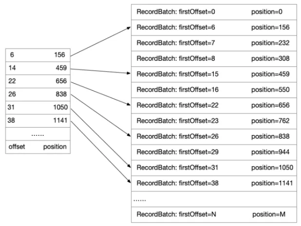

一：消息队列介绍？

1.1 消息队列使用场景

当系统中出现"数据生产"与"数据消费"的速度不一致；或者"数据生产"与"数据消费"两个环节的性能存在差异；或者在从数据生产到消费过程中遭遇到系统崩溃、链路耗时长尾、服务日志丢失等问题，就需要用到消息队列。

这样说比较抽象，举个在现实中存在的例子：

● 小明今天 10 个达布溜工资到账，打算购买 Apple Watch 提升生活档次（用来装逼），这时候他在某搜索页面发现某个之前没见过的电商平台推出了限时秒杀活动，Apple Watch 只需要官方价格的十分之一。激动的小明立马下载了 APP，并下了订单。但是由于此款新 APP 秒杀活动过于火爆并且设计过于垃圾，面对大量的数据请求时系统处理非常缓慢，以致于付了钱之后半天没有弹出下单成功的消息，这让小明怀疑自己是不是误下了一个杀猪 APP。经过了 180s 的苦等，下单成功的消息终于弹出来了。小明觉得消费体验十分差劲，发誓等 Apple Watch 送到家之后就把 APP 删了。

● 这怎么行？小明还没被这款 APP 宰，薅了个羊毛就跑了？APP 的老板十分生气，并把他们基础架构团队的张三直接炒鱿鱼了。

● 在以上的案例中，小明下单 Apple Watch，存在以下几个业务逻辑（不全）：发起订单、库存记录-1、订单记录+1、通知商家、消息反馈用户。小明等了 180s，可能是上面的任何一个或多个服务挂了。这里我们就假设"通知商家"这一服务挂掉了，张三处理了 180s 这项服务才重启。

● 这个架构肯定是有问题的，面对高量请求时就会服务瘫痪。而这种业务环境下状态是不能回滚的，毕竟小明付了钱，被举报了是有概率上 CCTV315 晚会的。

● 临危受命的李四接手了张三的工作，发现张三这小子居然把上述的五项服务设计成线型的，也就是说上一服务不完成就没办法进行下一服务，只要中间有一项服务宕机，后面的所有服务都会中断。

● 重点来了，李四重构时，引入了消息队列。直接将发起订单且付钱成功之后所将要处理的服务，通过消息的形式告诉消息队列，只要告诉完了，就可以直接执行"消息反馈服务"这项服务了。对于"库存-1"、"订单+1"和"通知商家"三项服务，后面只需慢慢消费消息队列中的消息就行了（当然怎么可能慢慢消费呢？库存没了要及时通知用户的，不然付了钱再退款可太麻烦了，因此要么把"库存-1"这项服务设计成不用消息队列的形式；要么保证其在消费消息队列信息的过程中能够保持高性能）

● 简单来说就是降低用户下单后看到反馈信息的时间，也是为了防止出事故而导致用户迟迟看不到反馈信息。用户至上，用户的问题先解决，APP 后面才能开始宰人（bushi）。如果中间的"通知商家"服务宕机了，由于存在消息队列，数据被保存在消息队列中，后面只要"通知商家"服务重启，就可以直接消费消息队列中的数据信息，整个服务流程照样完整。额...无非是商家发货慢了点。

1.2 消息队列的优点

1. 提高系统响应速度（这个很明显，1.1 提到的例子就是）

——小明下单付钱成功后，把数据消息直接扔进消息队列里，无需等待后续对数据的其他处理，直接把响应结果返回给小明。

2. 提高系统稳定性（这个也很明显，同样也是 1.1 的例子）

——小明下单后响应直接返回，不用怕后面的服务宕机，使用消息队列等服务重启后从消息队列中拿出数据消费就行了

3. 异步化、解耦、消除峰值（还是用 1.1 的例子 emmm）

——异步化、解耦、消除峰值可以一起讲，就是把总的业务逻辑拆分。像张三设计的架构是总线型，也就是所有逻辑全是主逻辑，一步出问题就全部出问题。使用消息队列对整个服务进行解耦，拆分为多个副逻辑，实现服务的异步化。由于有多个副逻辑对主逻辑进行分担，于是就可以降低主逻辑的流量峰值，保证主逻辑的运行速度，降低主逻辑崩溃概率（因为很多跟 C 端用户相关的业务逻辑都是在主逻辑层实现的）

二：案例——Kafka 实践

没错，首先要进入无聊的概念解释

2.1 kafka 架构

● Topic（逻辑队列）：

每一个不同的业务场景就对应一个 Topic，跟这项业务有关的所有数据都存储在这个 Topic 中

● Cluster（物理集群）：

每个集群中包含多个 Topic，即多个业务逻辑的组合

● Producer（生产者）：

消息的生产端，负责将业务消息发送到对应的 Topic

● Consumer（消费者）：

消息的消费端，负责将对应 Topic 中的消息取出消费

● ConsumerGroup（消费者组）：

多个消费者组成的集合，不同的消费者组要保证互不干涉

● Partition（消息分片）：

在 Topic 中存在多个 Partition，其实就是将消息拆分成多组进行存储，提高消息写入到 Topic 中的速度，以及加快被消费者读取的速度

上图中：存在两个生产者，将消息写入到 Topic 中，由于 Topic 中存在两个 Partition（分片），写入效率提升了一倍。存在两个消费者组，且都可以读取 Topic1 中的消息，而消费者组 1 存在两个消费者，所以读取速率是消费者组 2 的两倍。两个消费者组设计时实现了互不干涉，即不可能存在一条消息同时被两个消费者组读取到的情况

——接下来深入拆解 partition 分片

● Offset：

每一个分片中储存着多条消息，每条消息都有着一个唯一的 Offset，可以理解为消息的 ID，且这串 ID 在分片内部是递增的

● Replica：

可以理解为分片的副本，一般来说，数据要有备份，否则如果出现某台服务器的消息队列崩溃了，数据就不存在了。因此要有很好的容灾性，就必须将消息队列里的消息做多个副本。Replica 分为 Leader 和 Follower，Follower 负责同步 Leader 队列的数据。当 Leader 出故障之后，某个 Follower 就晋升为 Leader

● ISR：

一个分片中存在一个 ISR，与 Leader 信息大致同步的 Follower 就会存放在 ISR 中，如果 Follower 与 Leader 差距较大，就会被踢出 ISR。上述提到的 Leader 故障了，选择 Follower 晋升为新 Leader 也不是乱选的，它一定是 ISR 中最优的那一个。ISR 中的 Replica 排名，以前是根据与 Leader 的 Offset 差距来排的，现在变成了与 Leader 的时间差距

——谁来负责分配 Leader 和 Follower?（Broker）

上面这幅图代表着 Kafka 中副本的分布图。途中的 Broker 代表每一个 Kafka 节点，所有的 Broker 节点最终组成了一个集群。整个图表示：整个集群（Cluster）包含了四个 Broker 机器节点，集群中有两个 Topic，分别是 Topic1 和 Topic2，Topic1 中存在两个分片，Topic2 中只有一个分片。每个分片都是三副本状态。中间有一个 Broker 同时充当 Controller 的角色，是整个集群的大脑，负责对副本和其他 Broker 进行分配

——元数据存储（Zookeeper）

在集群的基础上，还有一个模块是 Zookeeper，负责储存集群的元数据信息，比如副本的分配信息和 Controller 计算好的方案

——最后上一张整体架构图

2.2 kafka 对业务如何做优化处理？

——Producer 方面的优化

1. 批量发送

上图就理解了，批量发送可以减少 IO 次数，加强发送能力

2. 数据压缩

还可以对数据进行压缩，通过减少消息大小的方式提高消息存入 Broker 中的速度

——Broker 方面的优化

1. 如何存储？——顺序写入

消息的存储是要存进磁盘里的，消息写入磁盘的过程中，需要通过移动磁头来找到对应磁道，磁盘转动找到对应扇区，最后写入。寻找磁道的成本是比较高的，因此采用顺序写入（新消息直接在 Partition 末尾追加），以减少时间成本

2. 如何迅速找消息返回给 Consumer？

Consumer 通过发送 FetchRequest 请求消息数据，Broker 会将指定的 Offset 处的消息，按照时间窗口和消息大小窗口发送给 Consumer，具体寻找消息的细节有以下三种方式

比如现在要寻找 Offset = 28 的消息

● 偏移量索引文件：（二分找到小于目标 Offset 的最大索引值）

● 时间戳索引文件：（二分找到小于目标时间戳最大的索引位置）

● 零拷贝：

传统拷贝要经历五步才能将数据从硬盘读到消费者进程，从硬盘空间到内核空间，再到应用空间，最后又经过内核空间到消费者进程。而零拷贝则直接略去了应用空间，直接从硬盘到内核空间到消费者进程。

——Consumer 方面的优化

其实就是如何解决 Partition 在 Consumer Group 中的分配方式？

● 手动分配（Low Level）

手动分配的一个好处就是启动比较快，因为对于每一个消费者来说，启动的时候就已经知道了自己应该去消费哪个分片了。就好比对下图中的 Consumer Group 1 来说，Consumer 1 去消费分片 123，Consumer 2 去消费分片 456，Consumer 3 去消费 78。这些 Consumer 再启动时就已经知道分配方案了。但这种分配方式却是危险的，假如 Consumer 3 挂掉了，78 分片就停止消费了。又假如现在新增了一个 Consumer 4 ，就要去停掉整个集群，重新修改配置再上线，以保证 Consumer 4 也可以消费数据。这样特别麻烦。

● 自动分配（High Level）

所以 Kafka 也提供了自动分配的方式，简单来说就是在 Broker 集群中，对于不同的 Consumer Group 来讲，都会选择一台 Broker 当作 Coordinator，而 Coordinator 作用就是帮助 Consumer Group 进行分片的分配，也叫做分片的 Rebalance。使用这种方式，如果 Consumer Group 中有发生宕机，或者有新的 Consumer 加入，整个分片和 Consumer 都会重新分配来达到一个稳定的消费状态

